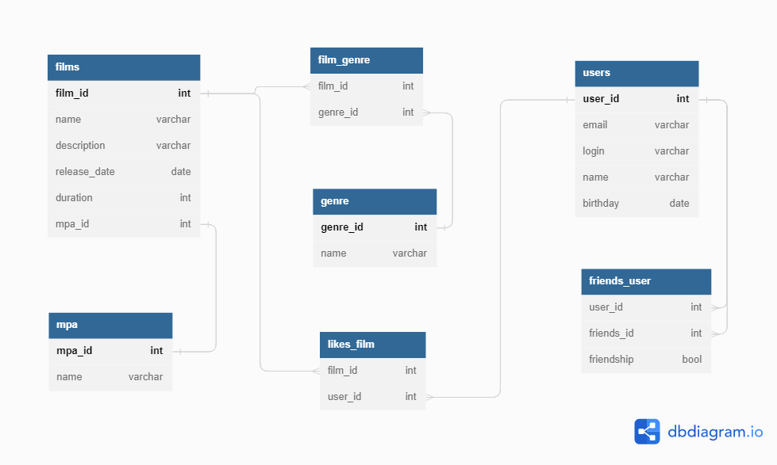

# java-filmorate
### Схема базы данных *java-filmorate*

#### *Таблицы с Данными*
- **films** список фильмов
- **mpa** рейтинг Ассоциации кинокомпаний
- **film_genre** связь фильмов с жанрами
- **genre** список жанров фильмов
- **likes_film** лайки пользователей
- **users** список пользователей
- **friends_user** связь дружбы пользователей
#### *Примеры SLQ-запросов*
-     Список всех фильмов
       - SELECT * FROM films;
-     Список всех пользователей
       - SELECT name FROM users;
-     Список 10 наиболее популярных фильмов
       - SELECT f.FILM_ID, f.NAME, COUNT(user_id) likes
          FROM FILMS f
          LEFT JOIN LIKES_FILM lf ON f.FILM_ID = lf.FILM_ID
          GROUP BY f.FILM_ID
          ORDER BY likes DESC LIMIT 10;